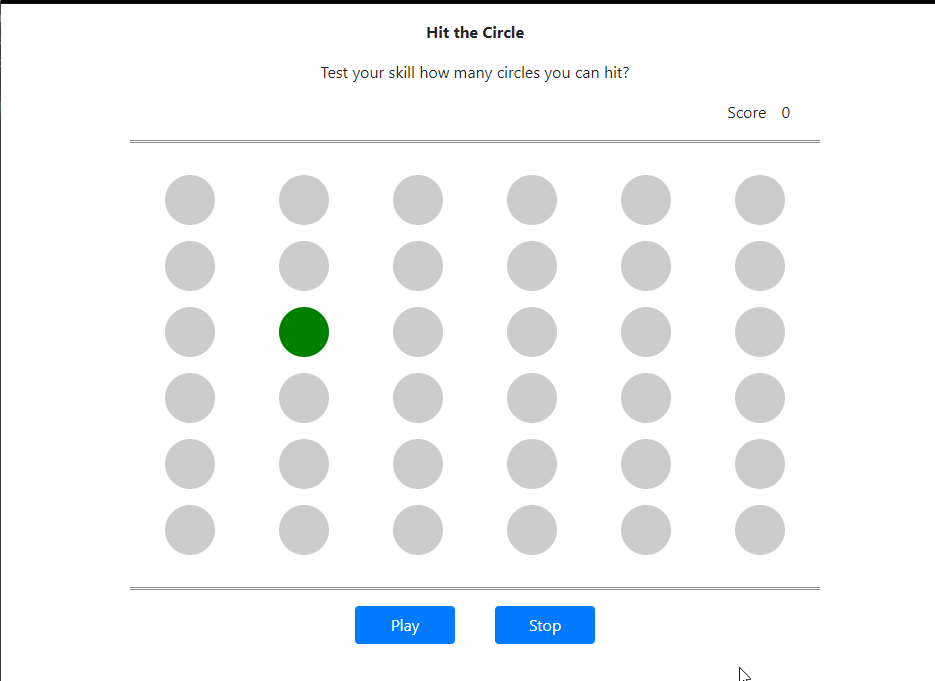

# TASK
## On play 

<ul>

<li> One circle should be randomly autoselected. 
<li>Further random auto-selection of circle should happen only when user hits the correct circle.  
<li>For each correct/incorrect hit by the user, increment/decrement the <li>score respectively in the score input box.
</ul>

## On stop 
<ul>
<li>Show an alert box with a message having the final score.  
<li>Sample Message –“Your final score is 10” oReset all the controls
</ul>

# How to Play
To start the game please click on play button

